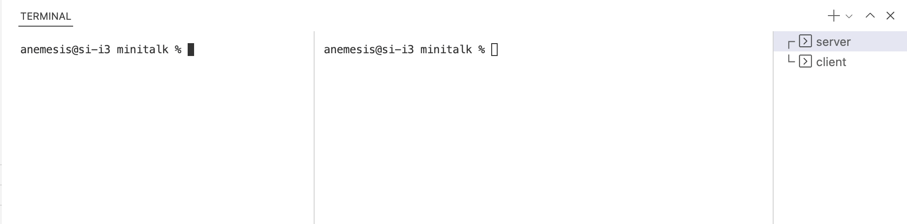

# **minitalk**

There are several ways to share data between two UNIX processes: pipes, shared files, sockets etc. But why not to send data bitwise via user UNIX signals: SIGUSR1 as 1 and SIGUSR2 as 0.
<br><br>



## **Platform**
macOS (x86).
<br><br>

## **Instruments**

Self-written libc functions library **"libft"** is used due to educational subject restrictions as well as readline analogue **"get_next_line"** and simplified version of printf **"ft_printf"**.

Source files are lintered by "**42 Norminette**" linter.
<br><br>

## **Usage**

Mandatory part

```console
host@name:~$ make # mandatory
host@name:~$ ./server
host@name:~$ ./clien server_PID "your message"
```

Bonus part

```console
host@name:~$ make bonus
host@name:~$ ./server_b
host@name:~$ ./clien_b server_PID "your message"
```
<br><br>


## **Features**

Unicode characters support.

Multiple clients support.

Client waits for server response in the bonus part.